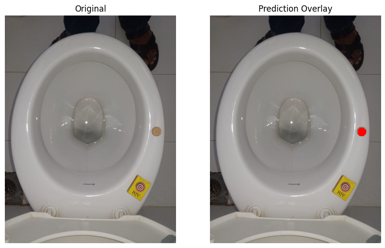
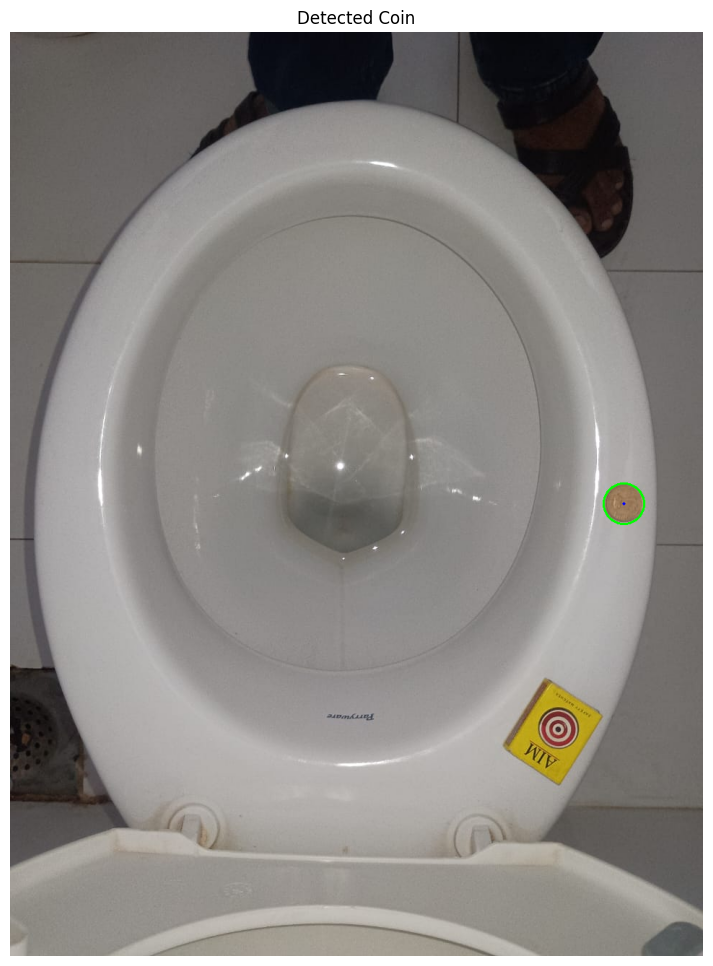

# ₹5 Coin Segmentation Model

This project features a deep learning model for detecting and measuring ₹5 coins. It is intended for use in computer vision calibration, object size referencing, and real-world dimension estimation in smart devices and automation systems.

## How to run the code

To train your very own segmentation model, follow these steps:

download and run the file named: [Internship_Reference_5_Coin.ipynb](Internship_Reference_5_Coin.ipynb) (NOTE: make sure to put the correct image path.)

It will train your own ₹5 Coin Segmentation model and predict the mask on the given toilet image and print the masked image to visualize the coin created.

It will also provide you with the pixels per cm and pixels per inch for your reference.

## Features

The model offers the following key functionalities:

* **Coin Detection (Open Toilet)**: Segments the ₹5 Coin as distinct structure.
* **Measurements**: Computes various metrics like radius, center and reference ratios like pixels/cm and pixels/inch.
* **Robustness**: Handles various toilet shapes (round, oval, square) on which ₹5 Coin is placed and different lighting conditions effectively.
* **Fine-tuning**: Can be fine-tuned using images with red markings.

## Model Overview

This is a semantic segmentation model built using deep learning techniques (e.g., UNet or Segmentation Models). It has been fine-tuned on toilet datasets that were manually marked with red overlays.

## Visual Examples

### Coin on top of Toilet – Coin Segmentation

**Raw Image and Predicted Mask**



### Measurement Output

**Visual Output**



**Measured Distances:**
* **Pixel Radius:** 28 px
* **Pixel Diameter:** 56 px
* **Estimated Diameter (inches):** 0.905 in
* **Estimated Diameter (cm):** 2.299 cm
* **Pixel per Inch Ratio:** 61.88 px/in
* **Pixel per CM Ratio:** 24.36 px/cm

## Technical Details

* **Framework**: PyTorch 
* **Model Type**: UNet / DeepLabV3+ / Custom Encoder 
* **Input Size**: 256x256 (internally resized) 
* **Output**: Binary mask 
* **Inference Speed**: Approximately 20ms per image (on GPU) 

## Training Notes

The model was initially trained on a real ₹5 Coin image datasets on top of toilets. These datasets featured clear rim boundaries and red elliptical markings for fine-tuning. The final fine-tuning process involved manually annotated red-marked masks.

Strict HSV thresholds are employed for red mask extraction:
```python
lower_red1 = np.array([0, 100, 100])
upper_red1 = np.array([10, 255, 255])
```

## Author

**Heet Savaliya**
B.Tech Computer Engineering
Pandit Deendayal Energy University

  * **LinkedIn**: [https://www.linkedin.com/in/heet-savaliya-03b863252/](https://www.google.com/search?q=https://www.linkedin.com/in/heet-savaliya-03b863252/)
  * **Email**: savaliyaheet19@gmail.com

## License

This project is released under the [MIT License](https://opensource.org/licenses/MIT). You are free to use, modify, and build upon this work.
